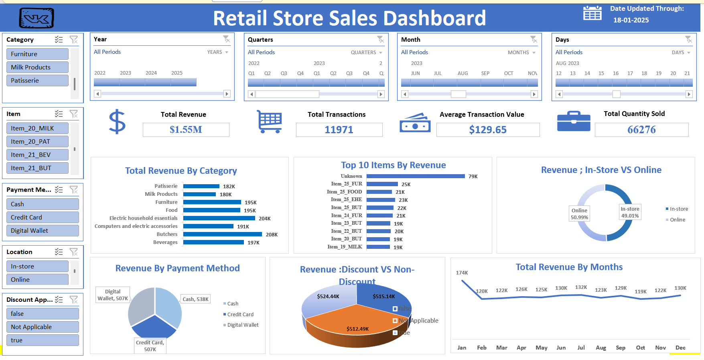

# Retail Store Sales Dashboard

Analysis of retail store sales data to identify trends, top categories, and revenue insights using Excel and Power Query.

##Dashboard

The interactive dashboard provides a clear view of:
- Revenue by category and item
- In-store vs Online channel split
- Revenue by payment method
- Discount impact (discounted vs non-discounted vs unrecorded)
- Monthly revenue trend
- KPI summary cards (Total Revenue, Total Transactions, Average Transaction Value, Total Quantity Sold)

## Objective
Analyze retail transaction data to identify key revenue drivers and data quality issues, then build an interactive dashboard with actionable business insights.

## Dataset
Retail Store Sales Dataset (Dirty — for Data Cleaning practice) — Kaggle:
https://www.kaggle.com/datasets/ahmedmohamed2003/retail-store-sales-dirty-for-data-cleaning

## Tools Used
- Microsoft Excel (Pivot Tables, Pivot Charts, KPI Cards, Slicer, Timeline)
- Power Query

## Files in this repo
- `01_retail_store_sales_Dataset.csv` — raw dataset
- `02_Retail_Store_Sales_Dashboard.xlsx` — interactive Excel dashboard
- `03_Retail_Store_Sales_Business_Analysis.docx` — detailed business analysis
- `04_Retail_Store_Sales_Business_Report.docx` — full business report summarizing insights, trends, and recommendations

- ## Methodology
- Collected data from Kaggle (Retail Store Sales — Dirty for Data Cleaning) and imported into Excel via Power Query for a refreshable, live connection.
- Profiled using Power Query's Column Quality, Column Distribution, and Column Profile tools to identify nulls, duplicates, and data types across the full dataset.
- Cleaned missing values: categorical gaps (Item, Payment Method, Location, Discount Applied) labeled 'Unknown'/'Not Applicable'; numeric gaps derived using Total Spent = Quantity × Price Per Unit.
- Extracted Year, Quarter, Month Name, Day Name, and Week of Year from Transaction Date.
- Converted data to a structured Excel Table for reliable pivot table and chart refresh.
- Built 10 pivot tables — 4 supporting KPI number cards and 6 feeding dashboard charts.
- Added 4 Timeline slicers (Year, Quarter, Month, Day) for date filtering at different levels of granularity.
- Assembled an interactive dashboard with 4 KPI cards, 6 charts, and category-based slicers.

## Key Findings
- Revenue from discounted transactions (₹512K) is almost identical to non-discounted transactions (₹515K) — the current discount strategy shows no clear evidence of driving incremental sales.
- 33% of transactions (₹524K in revenue) have no recorded discount status — the single largest revenue slice, pointing to a checkout/point-of-sale data capture gap rather than a real business pattern.
- Butchers (₹208K) and Electric Household Essentials (₹204K) are the top revenue categories; Milk Products (₹180K), despite being bought frequently, brings in the least.
- In-store (49%) and Online (51%) channels are almost evenly split.
- Cash (₹538K), Credit Card (₹507K), and Digital Wallet (₹507K) show no strong customer preference for any single payment method.
- The top-selling "item" in the data is labeled "Unknown" (₹79K), indicating a product-tracking gap.
- January shows a revenue spike (₹174K) compared to the rest of the year (₹119K–₹131K), with October the lowest (₹119.41K).

## Recommendations
- Investigate why 33% of transactions lack a recorded discount status — likely a point-of-sale data capture gap rather than a true business pattern.
- Fix item-level tracking before making product decisions, since 'Unknown' is currently the top revenue-generating line item.
- Run a controlled A/B discount test (same items, with and without discount) since discounted and non-discounted revenue are nearly equal.
- Explore category-specific bundling for high-frequency, lower-value categories like Milk Products to lift average transaction value.
- Continue monitoring the In-store vs Online balance so future marketing spend is not skewed toward the channel that already performs well.

## Conclusion
This project provides a structured view of retail transaction data and helps identify real revenue drivers versus data quality gaps that could mislead decision-making. The analysis supports better prioritization of data governance (fixing discount and item tracking) alongside genuine business insights like channel balance and seasonal trends.
The dashboard and supporting analysis can be used as a simple decision-support tool for reviewing retail sales performance and planning targeted interventions like A/B testing and bundling strategies.

